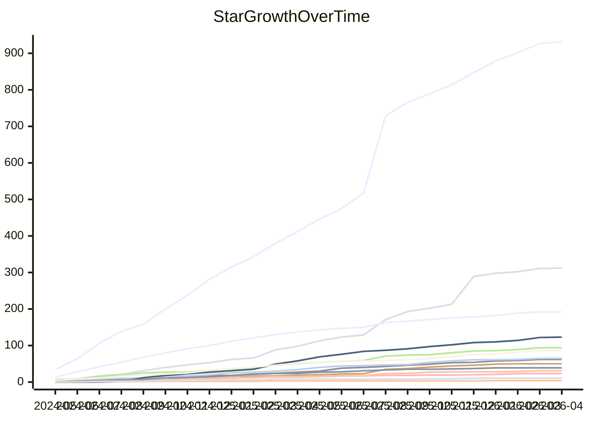

# Statistics

## Star History

_Generated on 2026-04-06_

### Top Repositories

## Repository Summary

_Generated on 2026-04-06 · 128 repositories_

| Repository | Description | Stars | Forks | Contributors | Issues | PRs |
|:-----------|:------------|------:|------:|-------------:|-------:|----:|
| [firmware](https://github.com/OpenIPC/firmware) | Alternative IP Camera firmware from an open community | 1973 | 384 | 84 | [255](https://github.com/OpenIPC/firmware/issues) | [8](https://github.com/OpenIPC/firmware/pulls) |
| [majestic](https://github.com/OpenIPC/majestic) | Majestic Community edition integration kit | 61 | 7 | 4 | [73](https://github.com/OpenIPC/majestic/issues) | [0](https://github.com/OpenIPC/majestic/pulls) |
| [PixelPilot](https://github.com/OpenIPC/PixelPilot) | PixelPilot is an Android app packaging multiple pieces to… | 124 | 41 | 12 | [29](https://github.com/OpenIPC/PixelPilot/issues) | [1](https://github.com/OpenIPC/PixelPilot/pulls) |
| [PixelPilot_rk](https://github.com/OpenIPC/PixelPilot_rk) | Application that decodes an RTP Video Stream and displays… | 50 | 35 | 19 | [17](https://github.com/OpenIPC/PixelPilot_rk/issues) | [4](https://github.com/OpenIPC/PixelPilot_rk/pulls) |
| [dashboard](https://github.com/OpenIPC/dashboard) | Dashboard is a cross-platform (Lin/Mac/Win) desktop appli… | 12 | 3 | 1 | [17](https://github.com/OpenIPC/dashboard/issues) | [0](https://github.com/OpenIPC/dashboard/pulls) |
| [sbc-groundstations](https://github.com/OpenIPC/sbc-groundstations) | sbc-groundstations | 103 | 23 | 3 | [13](https://github.com/OpenIPC/sbc-groundstations/issues) | [4](https://github.com/OpenIPC/sbc-groundstations/pulls) |
| [webui](https://github.com/OpenIPC/webui) | OpenIPC web interface. | 55 | 36 | 23 | [16](https://github.com/OpenIPC/webui/issues) | [0](https://github.com/OpenIPC/webui/pulls) |
| [companion](https://github.com/OpenIPC/companion) | An official multi-platform configuration tool for OpenIPC… | 38 | 10 | 4 | [14](https://github.com/OpenIPC/companion/issues) | [1](https://github.com/OpenIPC/companion/pulls) |
| [builder](https://github.com/OpenIPC/builder) | Experimental system for building OpenIPC firmware for kno… | 74 | 97 | 26 | [9](https://github.com/OpenIPC/builder/issues) | [5](https://github.com/OpenIPC/builder/pulls) |
| [coupler](https://github.com/OpenIPC/coupler) | Seamless transition between video cameras firmware | 110 | 28 | 17 | [14](https://github.com/OpenIPC/coupler/issues) | [0](https://github.com/OpenIPC/coupler/pulls) |
| [device-mjsxj02hl](https://github.com/OpenIPC/device-mjsxj02hl) | OpenIPC for Xiaomi MJSXJ02HL | 76 | 14 | 6 | [13](https://github.com/OpenIPC/device-mjsxj02hl/issues) | [0](https://github.com/OpenIPC/device-mjsxj02hl/pulls) |
| [ipctool](https://github.com/OpenIPC/ipctool) | Simple tool (and library) for checking IP camera hardware | 229 | 56 | 25 | [11](https://github.com/OpenIPC/ipctool/issues) | [0](https://github.com/OpenIPC/ipctool/pulls) |
| [majestic-webui](https://github.com/OpenIPC/majestic-webui) | Web interface for OpenIPC firmware. | 30 | 20 | 14 | [9](https://github.com/OpenIPC/majestic-webui/issues) | [1](https://github.com/OpenIPC/majestic-webui/pulls) |
| [msposd](https://github.com/OpenIPC/msposd) | OpenIPC implementation of MSP Displayport OSD for INAV/Be… | 48 | 32 | 13 | [6](https://github.com/OpenIPC/msposd/issues) | [3](https://github.com/OpenIPC/msposd/pulls) |
| [smolrtsp](https://github.com/OpenIPC/smolrtsp) | A lightweight real-time streaming library for IP cameras | 467 | 111 | 6 | [8](https://github.com/OpenIPC/smolrtsp/issues) | [0](https://github.com/OpenIPC/smolrtsp/pulls) |
| [adaptive-link](https://github.com/OpenIPC/adaptive-link) | Greg's Adaptive-Link - Files for OpenIPC camera and Radxa… | 27 | 10 | 6 | [5](https://github.com/OpenIPC/adaptive-link/issues) | [2](https://github.com/OpenIPC/adaptive-link/pulls) |
| [device-mjsxj03hl](https://github.com/OpenIPC/device-mjsxj03hl) | OpenIPC for Xiaomi MJSXJ03HL | 70 | 16 | 8 | [7](https://github.com/OpenIPC/device-mjsxj03hl/issues) | [0](https://github.com/OpenIPC/device-mjsxj03hl/pulls) |
| [burn](https://github.com/OpenIPC/burn) | OpenSource tool to unbrick HiSilicon and Goke devices | 48 | 20 | 10 | [5](https://github.com/OpenIPC/burn/issues) | [0](https://github.com/OpenIPC/burn/pulls) |
| [mavfwd](https://github.com/OpenIPC/mavfwd) | Simplest MAVLink serial port to UDP forwarder in pure C | 23 | 21 | 7 | [3](https://github.com/OpenIPC/mavfwd/issues) | [2](https://github.com/OpenIPC/mavfwd/pulls) |
| [u-boot-gk7205v200](https://github.com/OpenIPC/u-boot-gk7205v200) | U-Boot for gk7205v200 group SoC's | 12 | 15 | 5 | [0](https://github.com/OpenIPC/u-boot-gk7205v200/issues) | [4](https://github.com/OpenIPC/u-boot-gk7205v200/pulls) |
| [wfb-ng-openwrt](https://github.com/OpenIPC/wfb-ng-openwrt) | WFB-NG for OpenWrt | 30 | 5 | 2 | [4](https://github.com/OpenIPC/wfb-ng-openwrt/issues) | [0](https://github.com/OpenIPC/wfb-ng-openwrt/pulls) |
| [chaos_calmer](https://github.com/OpenIPC/chaos_calmer) (A) (F) | OpenIPC 1.0 (OpenWRT-based), not maintained anymore | 189 | 19 | 57 | [3](https://github.com/OpenIPC/chaos_calmer/issues) | [0](https://github.com/OpenIPC/chaos_calmer/pulls) |
| [linux](https://github.com/OpenIPC/linux) | Linux kernels for OpenIPC firmware | 30 | 41 | 5 | [1](https://github.com/OpenIPC/linux/issues) | [2](https://github.com/OpenIPC/linux/pulls) |
| [motors](https://github.com/OpenIPC/motors) | Various code to manage motor hardware | 31 | 22 | 11 | [3](https://github.com/OpenIPC/motors/issues) | [0](https://github.com/OpenIPC/motors/pulls) |
| [openhisilicon](https://github.com/OpenIPC/openhisilicon) | Opensource Hisilicon SoCs SDK | 39 | 17 | 11 | [3](https://github.com/OpenIPC/openhisilicon/issues) | [0](https://github.com/OpenIPC/openhisilicon/pulls) |
| [research](https://github.com/OpenIPC/research) | Simple FPV research | 65 | 33 | 11 | [3](https://github.com/OpenIPC/research/issues) | [0](https://github.com/OpenIPC/research/pulls) |
| [aviateur](https://github.com/OpenIPC/aviateur) | Cross-platform OpenIPC FPV ground station for Linux/Windo… | 50 | 13 | 3 | [2](https://github.com/OpenIPC/aviateur/issues) | [0](https://github.com/OpenIPC/aviateur/pulls) |
| [decoder](https://github.com/OpenIPC/decoder) | Miniature and universal H.264 and H.265 decoder for Andro… | 3 | 2 | 3 | [2](https://github.com/OpenIPC/decoder/issues) | [0](https://github.com/OpenIPC/decoder/pulls) |
| [defib](https://github.com/OpenIPC/defib) | Universal camera recovery tool - shocking dead devices ba… | 0 | 0 | 1 | [2](https://github.com/OpenIPC/defib/issues) | [0](https://github.com/OpenIPC/defib/pulls) |
| [dms](https://github.com/OpenIPC/dms) | Device Management System | 2 | 2 | 2 | [2](https://github.com/OpenIPC/dms/issues) | [0](https://github.com/OpenIPC/dms/pulls) |
| [fpv4win](https://github.com/OpenIPC/fpv4win) | WiFi Broadcast FPV client for Windows platform | 67 | 21 | 2 | [2](https://github.com/OpenIPC/fpv4win/issues) | [0](https://github.com/OpenIPC/fpv4win/pulls) |
| [improver](https://github.com/OpenIPC/improver) | OpenIPC Improver for setting up FPV and URLLC devices | 6 | 1 | 2 | [2](https://github.com/OpenIPC/improver/issues) | [0](https://github.com/OpenIPC/improver/pulls) |
| [mini](https://github.com/OpenIPC/mini) | OpenSource Mini IP camera streamer | 111 | 53 | 7 | [2](https://github.com/OpenIPC/mini/issues) | [0](https://github.com/OpenIPC/mini/pulls) |
| [wiki](https://github.com/OpenIPC/wiki) | Current Wiki | 406 | 211 | 129 | [0](https://github.com/OpenIPC/wiki/issues) | [2](https://github.com/OpenIPC/wiki/pulls) |
| [divinus](https://github.com/OpenIPC/divinus) | Multi-platform open source streamer | 65 | 31 | 7 | [1](https://github.com/OpenIPC/divinus/issues) | [0](https://github.com/OpenIPC/divinus/pulls) |
| [docs](https://github.com/OpenIPC/docs) | The new OpenIPC docs | 12 | 34 | 24 | [1](https://github.com/OpenIPC/docs/issues) | [0](https://github.com/OpenIPC/docs/pulls) |
| [faceter](https://github.com/OpenIPC/faceter) | Integration with the Faceter project | 2 | 0 | 4 | [1](https://github.com/OpenIPC/faceter/issues) | [0](https://github.com/OpenIPC/faceter/pulls) |
| [fancyweb-ng](https://github.com/OpenIPC/fancyweb-ng) | New generation of FancyWeb interface | 0 | 1 | 1 | [0](https://github.com/OpenIPC/fancyweb-ng/issues) | [1](https://github.com/OpenIPC/fancyweb-ng/pulls) |
| [intercom](https://github.com/OpenIPC/intercom) | SIP Doorphone on OpenIPC | 1 | 1 | 2 | [1](https://github.com/OpenIPC/intercom/issues) | [0](https://github.com/OpenIPC/intercom/pulls) |
| [microsnander](https://github.com/OpenIPC/microsnander) | Stripped down and modified version of Serial Nor/nAND/Eep… | 9 | 1 | 3 | [0](https://github.com/OpenIPC/microsnander/issues) | [1](https://github.com/OpenIPC/microsnander/pulls) |
| [opendrm](https://github.com/OpenIPC/opendrm) | OpenDRM | 0 | 0 | 1 | [0](https://github.com/OpenIPC/opendrm/issues) | [1](https://github.com/OpenIPC/opendrm/pulls) |
| [opendrm-web](https://github.com/OpenIPC/opendrm-web) | OpenDRM-web | 0 | 0 | 1 | [0](https://github.com/OpenIPC/opendrm-web/issues) | [1](https://github.com/OpenIPC/opendrm-web/pulls) |
| [packages](https://github.com/OpenIPC/packages) | New OpenIPC packages feed - futurum | 5 | 2 | 3 | [0](https://github.com/OpenIPC/packages/issues) | [1](https://github.com/OpenIPC/packages/pulls) |
| [python-dvr](https://github.com/OpenIPC/python-dvr) | python-dvr - library for configuring a wide range of IP c… | 57 | 11 | 4 | [0](https://github.com/OpenIPC/python-dvr/issues) | [1](https://github.com/OpenIPC/python-dvr/pulls) |
| [u-boot-hi3516cv200](https://github.com/OpenIPC/u-boot-hi3516cv200) | U-Boot for hi3516cv200 group SoC's | 7 | 1 | 2 | [0](https://github.com/OpenIPC/u-boot-hi3516cv200/issues) | [1](https://github.com/OpenIPC/u-boot-hi3516cv200/pulls) |
| [u-boot-hi3516ev200](https://github.com/OpenIPC/u-boot-hi3516ev200) | U-Boot for hi3516ev200 group SoC's | 6 | 5 | 3 | [0](https://github.com/OpenIPC/u-boot-hi3516ev200/issues) | [1](https://github.com/OpenIPC/u-boot-hi3516ev200/pulls) |
| [u-boot-ingenic](https://github.com/OpenIPC/u-boot-ingenic) | U-Boot for Ingenic SoC's | 16 | 14 | 5 | [0](https://github.com/OpenIPC/u-boot-ingenic/issues) | [1](https://github.com/OpenIPC/u-boot-ingenic/pulls) |
| [yaml-cli](https://github.com/OpenIPC/yaml-cli) | Simple YAML console tool | 6 | 5 | 8 | [1](https://github.com/OpenIPC/yaml-cli/issues) | [0](https://github.com/OpenIPC/yaml-cli/pulls) |
| [.github](https://github.com/OpenIPC/.github) | OpenIPC is a Linux operating system targeting IP cameras | 6 | 2 | 7 | [0](https://github.com/OpenIPC/.github/issues) | [0](https://github.com/OpenIPC/.github/pulls) |
| [aic8800](https://github.com/OpenIPC/aic8800) | The aic8800 WiFi diver | 28 | 15 | 3 | [0](https://github.com/OpenIPC/aic8800/issues) | [0](https://github.com/OpenIPC/aic8800/pulls) |
| [ak3918ev200](https://github.com/OpenIPC/ak3918ev200) | Reverse engineering of the AK3918EV200 ISP: tools, logs, … | 4 | 4 | 1 | [0](https://github.com/OpenIPC/ak3918ev200/issues) | [0](https://github.com/OpenIPC/ak3918ev200/pulls) |
| [atbm_60xx](https://github.com/OpenIPC/atbm_60xx) | AltoBeam atbm WiFi driver | 3 | 7 | 3 | [0](https://github.com/OpenIPC/atbm_60xx/issues) | [0](https://github.com/OpenIPC/atbm_60xx/pulls) |
| [audioplayer](https://github.com/OpenIPC/audioplayer) | Simple command line audioplayer for HiSilicon IPC | 5 | 5 | 2 | [0](https://github.com/OpenIPC/audioplayer/issues) | [0](https://github.com/OpenIPC/audioplayer/pulls) |
| [br-cache](https://github.com/OpenIPC/br-cache) | Buildroot Cache Repo for CI | 1 | 0 | 2 | [0](https://github.com/OpenIPC/br-cache/issues) | [0](https://github.com/OpenIPC/br-cache/pulls) |
| [ca813rf](https://github.com/OpenIPC/ca813rf) | Repository with new driver from Caddx | 3 | 0 | 1 | [0](https://github.com/OpenIPC/ca813rf/issues) | [0](https://github.com/OpenIPC/ca813rf/pulls) |
| [camerasrnd](https://github.com/OpenIPC/camerasrnd) | Experiments with cheap Linux cameras | 147 | 28 | 12 | [0](https://github.com/OpenIPC/camerasrnd/issues) | [0](https://github.com/OpenIPC/camerasrnd/pulls) |
| [capjpeg](https://github.com/OpenIPC/capjpeg) | Quick and dirty libimp (T31 - ingenic) testing for catpur… | 5 | 2 | 2 | [0](https://github.com/OpenIPC/capjpeg/issues) | [0](https://github.com/OpenIPC/capjpeg/pulls) |
| [compact-presets](https://github.com/OpenIPC/compact-presets) | Compact presets for OpenIPC FPV devices | 1 | 0 | 1 | [0](https://github.com/OpenIPC/compact-presets/issues) | [0](https://github.com/OpenIPC/compact-presets/pulls) |
| [composer](https://github.com/OpenIPC/composer) (A) | Creating OpenIPC firmware with custom settings | 7 | 9 | 6 | [0](https://github.com/OpenIPC/composer/issues) | [0](https://github.com/OpenIPC/composer/pulls) |
| [configurator](https://github.com/OpenIPC/configurator) | Configurator for setting up OpenIPC FPV and URLLC devices | 36 | 15 | 7 | [0](https://github.com/OpenIPC/configurator/issues) | [0](https://github.com/OpenIPC/configurator/pulls) |
| [debrick](https://github.com/OpenIPC/debrick) | Recovering Hisi/Goke devices | 8 | 1 | 2 | [0](https://github.com/OpenIPC/debrick/issues) | [0](https://github.com/OpenIPC/debrick/pulls) |
| [device-cip-37210](https://github.com/OpenIPC/device-cip-37210) | OpenIPC for Smartwares CIP-37210 | 5 | 1 | 2 | [0](https://github.com/OpenIPC/device-cip-37210/issues) | [0](https://github.com/OpenIPC/device-cip-37210/pulls) |
| [device-ezviz](https://github.com/OpenIPC/device-ezviz) | OpenIPC for EZVIZ | 6 | 1 | 3 | [0](https://github.com/OpenIPC/device-ezviz/issues) | [0](https://github.com/OpenIPC/device-ezviz/pulls) |
| [device-msc3xx](https://github.com/OpenIPC/device-msc3xx) | Experiments with MSC313E and MSC316DC | 0 | 1 | 2 | [0](https://github.com/OpenIPC/device-msc3xx/issues) | [0](https://github.com/OpenIPC/device-msc3xx/pulls) |
| [devourer](https://github.com/OpenIPC/devourer) | The RTL8812AU driver that simply devours its competitors | 29 | 16 | 6 | [0](https://github.com/OpenIPC/devourer/issues) | [0](https://github.com/OpenIPC/devourer/pulls) |
| [distributor](https://github.com/OpenIPC/distributor) | Internal Workflow System | 1 | 3 | 4 | [0](https://github.com/OpenIPC/distributor/issues) | [0](https://github.com/OpenIPC/distributor/pulls) |
| [fancyweb](https://github.com/OpenIPC/fancyweb) | Fancy WEB interface using React | 3 | 1 | 2 | [0](https://github.com/OpenIPC/fancyweb/issues) | [0](https://github.com/OpenIPC/fancyweb/pulls) |
| [fpv](https://github.com/OpenIPC/fpv) | A repository for storing and maintaining version history … | 3 | 0 | 1 | [0](https://github.com/OpenIPC/fpv/issues) | [0](https://github.com/OpenIPC/fpv/pulls) |
| [fpv-presets](https://github.com/OpenIPC/fpv-presets) | Presets for configuring OpenIPC FPV systems | 13 | 7 | 3 | [0](https://github.com/OpenIPC/fpv-presets/issues) | [0](https://github.com/OpenIPC/fpv-presets/pulls) |
| [gkrcparams](https://github.com/OpenIPC/gkrcparams) | Tool for changning HiSilicon/Goke encoder params | 0 | 5 | 5 | [0](https://github.com/OpenIPC/gkrcparams/issues) | [0](https://github.com/OpenIPC/gkrcparams/pulls) |
| [glutinium](https://github.com/OpenIPC/glutinium) | Glutinium - OpenWrt & Buildroot packages for extends func… | 122 | 57 | 6 | [0](https://github.com/OpenIPC/glutinium/issues) | [0](https://github.com/OpenIPC/glutinium/pulls) |
| [hardware](https://github.com/OpenIPC/hardware) | A collection of hardware developments by the OpenIPC team | 27 | 13 | 8 | [0](https://github.com/OpenIPC/hardware/issues) | [0](https://github.com/OpenIPC/hardware/pulls) |
| [hass](https://github.com/OpenIPC/hass) | OpenIPC Ecosystem for Home Assistant | 1 | 0 | 2 | [0](https://github.com/OpenIPC/hass/issues) | [0](https://github.com/OpenIPC/hass/pulls) |
| [hi_osd](https://github.com/OpenIPC/hi_osd) | Provide additional OSD regions on Hisilicon-based IPC | 5 | 2 | 2 | [0](https://github.com/OpenIPC/hi_osd/issues) | [0](https://github.com/OpenIPC/hi_osd/pulls) |
| [hisi-trace](https://github.com/OpenIPC/hisi-trace) | A utility to run Sofia from XM in a non-stock environment | 9 | 4 | 3 | [0](https://github.com/OpenIPC/hisi-trace/issues) | [0](https://github.com/OpenIPC/hisi-trace/pulls) |
| [hisinad](https://github.com/OpenIPC/hisinad) | HISINAD - experiments with hi3516cv100 (and similar v1 Hi… | 0 | 1 | 3 | [0](https://github.com/OpenIPC/hisinad/issues) | [0](https://github.com/OpenIPC/hisinad/pulls) |
| [improver-legacy](https://github.com/OpenIPC/improver-legacy) | OpenIPC Improver (legacy) for setting up FPV and URLLC de… | 1 | 0 | 2 | [0](https://github.com/OpenIPC/improver-legacy/issues) | [0](https://github.com/OpenIPC/improver-legacy/pulls) |
| [interface](https://github.com/OpenIPC/interface) | OpenIPC Common Interface Prototype | 1 | 0 | 4 | [0](https://github.com/OpenIPC/interface/issues) | [0](https://github.com/OpenIPC/interface/pulls) |
| [ipctool_tests](https://github.com/OpenIPC/ipctool_tests) | PoC for do CI on distributed collection of hardware | 4 | 0 | 2 | [0](https://github.com/OpenIPC/ipctool_tests/issues) | [0](https://github.com/OpenIPC/ipctool_tests/pulls) |
| [libde265](https://github.com/OpenIPC/libde265) (F) | Fork of open h.265 video codec implementation (optimized … | 11 | 0 | 15 | [0](https://github.com/OpenIPC/libde265/issues) | [0](https://github.com/OpenIPC/libde265/pulls) |
| [LoTool](https://github.com/OpenIPC/LoTool) | Internal chip information extractor from HiSilicon HiTool | 13 | 1 | 3 | [0](https://github.com/OpenIPC/LoTool/issues) | [0](https://github.com/OpenIPC/LoTool/pulls) |
| [majestic-plugins](https://github.com/OpenIPC/majestic-plugins) | Majestic plugins for OpenIPC | 6 | 5 | 4 | [0](https://github.com/OpenIPC/majestic-plugins/issues) | [0](https://github.com/OpenIPC/majestic-plugins/pulls) |
| [mediantrading](https://github.com/OpenIPC/mediantrading) | Micro-site for MedianTrading in collaboration with OpenIPC | 0 | 0 | 1 | [0](https://github.com/OpenIPC/mediantrading/issues) | [0](https://github.com/OpenIPC/mediantrading/pulls) |
| [modding](https://github.com/OpenIPC/modding) | IPCam modding scripts | 8 | 3 | 2 | [0](https://github.com/OpenIPC/modding/issues) | [0](https://github.com/OpenIPC/modding/pulls) |
| [mt7601u](https://github.com/OpenIPC/mt7601u) | Mediatek WLAN drivers | 1 | 2 | 1 | [0](https://github.com/OpenIPC/mt7601u/issues) | [0](https://github.com/OpenIPC/mt7601u/pulls) |
| [openingenic](https://github.com/OpenIPC/openingenic) | Opensource Ingenic SoCs SDK | 15 | 25 | 5 | [0](https://github.com/OpenIPC/openingenic/issues) | [0](https://github.com/OpenIPC/openingenic/pulls) |
| [openipc.github.io](https://github.com/OpenIPC/openipc.github.io) | Alternative IP Camera firmware from an open community | 35 | 11 | 14 | [0](https://github.com/OpenIPC/openipc.github.io/issues) | [0](https://github.com/OpenIPC/openipc.github.io/pulls) |
| [openxiongmai](https://github.com/OpenIPC/openxiongmai) | Opensource Xiongmai SoCs SDK | 13 | 5 | 3 | [0](https://github.com/OpenIPC/openxiongmai/issues) | [0](https://github.com/OpenIPC/openxiongmai/pulls) |
| [osd](https://github.com/OpenIPC/osd) | An all-in-one daemon that exposes an HTTP frontend to adj… | 11 | 6 | 4 | [0](https://github.com/OpenIPC/osd/issues) | [0](https://github.com/OpenIPC/osd/pulls) |
| [pqtools](https://github.com/OpenIPC/pqtools) | Various testing stuff | 1 | 2 | 3 | [0](https://github.com/OpenIPC/pqtools/issues) | [0](https://github.com/OpenIPC/pqtools/pulls) |
| [pristine](https://github.com/OpenIPC/pristine) | Streamlined integration of IP cameras into Windows apps | 4 | 1 | 2 | [0](https://github.com/OpenIPC/pristine/issues) | [0](https://github.com/OpenIPC/pristine/pulls) |
| [pyosd](https://github.com/OpenIPC/pyosd) | OSD python app to run on MacOS | 8 | 0 | 2 | [0](https://github.com/OpenIPC/pyosd/issues) | [0](https://github.com/OpenIPC/pyosd/pulls) |
| [qemu](https://github.com/OpenIPC/qemu) | A platform for experiments with emulation of launching Hi… | 0 | 0 | 309 | [0](https://github.com/OpenIPC/qemu/issues) | [0](https://github.com/OpenIPC/qemu/pulls) |
| [quirc](https://github.com/OpenIPC/quirc) (F) | QR decoder library | 0 | 2 | 11 | [0](https://github.com/OpenIPC/quirc/issues) | [0](https://github.com/OpenIPC/quirc/pulls) |
| [realtek-wlan](https://github.com/OpenIPC/realtek-wlan) | Realtek WLAN drivers | 7 | 11 | 1 | [0](https://github.com/OpenIPC/realtek-wlan/issues) | [0](https://github.com/OpenIPC/realtek-wlan/pulls) |
| [rnd-player](https://github.com/OpenIPC/rnd-player) | A simple R&D player, entirely created by AI without human… | 0 | 0 | 1 | [0](https://github.com/OpenIPC/rnd-player/issues) | [0](https://github.com/OpenIPC/rnd-player/pulls) |
| [sandbox](https://github.com/OpenIPC/sandbox) | Sandbox for experiments in the OpenIPC project | 9 | 16 | 15 | [0](https://github.com/OpenIPC/sandbox/issues) | [0](https://github.com/OpenIPC/sandbox/pulls) |
| [sandbox-fpv](https://github.com/OpenIPC/sandbox-fpv) | Sandbox for FPV experiments | 65 | 26 | 5 | [0](https://github.com/OpenIPC/sandbox-fpv/issues) | [0](https://github.com/OpenIPC/sandbox-fpv/pulls) |
| [sensor-profiles](https://github.com/OpenIPC/sensor-profiles) | Collection of profiles for various sensors | 3 | 4 | 3 | [0](https://github.com/OpenIPC/sensor-profiles/issues) | [0](https://github.com/OpenIPC/sensor-profiles/pulls) |
| [sensors](https://github.com/OpenIPC/sensors) | About Source code and ready-to-use drivers for video came… | 4 | 2 | 6 | [0](https://github.com/OpenIPC/sensors/issues) | [0](https://github.com/OpenIPC/sensors/pulls) |
| [smolrtsp-libevent](https://github.com/OpenIPC/smolrtsp-libevent) | SmolRTSP + libevent 2.x | 12 | 6 | 2 | [0](https://github.com/OpenIPC/smolrtsp-libevent/issues) | [0](https://github.com/OpenIPC/smolrtsp-libevent/pulls) |
| [snander-mstar](https://github.com/OpenIPC/snander-mstar) | CH341A I2C MStar programmer | 15 | 3 | 1 | [0](https://github.com/OpenIPC/snander-mstar/issues) | [0](https://github.com/OpenIPC/snander-mstar/pulls) |
| [ssv6x5x](https://github.com/OpenIPC/ssv6x5x) | iComm Semiconductor ssv6x5x WiFi driver | 1 | 3 | 2 | [0](https://github.com/OpenIPC/ssv6x5x/issues) | [0](https://github.com/OpenIPC/ssv6x5x/pulls) |
| [ssw101b](https://github.com/OpenIPC/ssw101b) | SigmaStar ssw101b WiFi driver | 7 | 4 | 3 | [0](https://github.com/OpenIPC/ssw101b/issues) | [0](https://github.com/OpenIPC/ssw101b/pulls) |
| [steam-groundstations](https://github.com/OpenIPC/steam-groundstations) | OpenIPC Steam Deck Groundstation | 15 | 3 | 2 | [0](https://github.com/OpenIPC/steam-groundstations/issues) | [0](https://github.com/OpenIPC/steam-groundstations/pulls) |
| [telkam](https://github.com/OpenIPC/telkam) | Telkam - a intellectual demon that turns a camera into a … | 1 | 0 | 1 | [0](https://github.com/OpenIPC/telkam/issues) | [0](https://github.com/OpenIPC/telkam/pulls) |
| [toolchains](https://github.com/OpenIPC/toolchains) | HiSilicon cross-compilation toolchains for OpenIPC | 0 | 0 | 1 | [0](https://github.com/OpenIPC/toolchains/issues) | [0](https://github.com/OpenIPC/toolchains/pulls) |
| [u-boot-allwinner](https://github.com/OpenIPC/u-boot-allwinner) | U-Boot for Allwinner SoC's | 4 | 0 | 3 | [0](https://github.com/OpenIPC/u-boot-allwinner/issues) | [0](https://github.com/OpenIPC/u-boot-allwinner/pulls) |
| [u-boot-grainmedia](https://github.com/OpenIPC/u-boot-grainmedia) | U-Boot for GrainMedia SoC's | 2 | 1 | 2 | [0](https://github.com/OpenIPC/u-boot-grainmedia/issues) | [0](https://github.com/OpenIPC/u-boot-grainmedia/pulls) |
| [u-boot-hi3516av100](https://github.com/OpenIPC/u-boot-hi3516av100) | U-Boot for hi3516av100 group SoC's | 4 | 1 | 3 | [0](https://github.com/OpenIPC/u-boot-hi3516av100/issues) | [0](https://github.com/OpenIPC/u-boot-hi3516av100/pulls) |
| [u-boot-hi3516cv100](https://github.com/OpenIPC/u-boot-hi3516cv100) | U-Boot for hi3516cv100 group SoC's | 5 | 1 | 2 | [0](https://github.com/OpenIPC/u-boot-hi3516cv100/issues) | [0](https://github.com/OpenIPC/u-boot-hi3516cv100/pulls) |
| [u-boot-hi3516cv300](https://github.com/OpenIPC/u-boot-hi3516cv300) | U-Boot for hi3516cv300 group SoC's | 5 | 0 | 2 | [0](https://github.com/OpenIPC/u-boot-hi3516cv300/issues) | [0](https://github.com/OpenIPC/u-boot-hi3516cv300/pulls) |
| [u-boot-hi3516cv500](https://github.com/OpenIPC/u-boot-hi3516cv500) | U-Boot for hi3516cv500 group SoC's | 3 | 1 | 2 | [0](https://github.com/OpenIPC/u-boot-hi3516cv500/issues) | [0](https://github.com/OpenIPC/u-boot-hi3516cv500/pulls) |
| [u-boot-hi3519v101](https://github.com/OpenIPC/u-boot-hi3519v101) | U-Boot for hi3519v101 group SoC's | 4 | 0 | 2 | [0](https://github.com/OpenIPC/u-boot-hi3519v101/issues) | [0](https://github.com/OpenIPC/u-boot-hi3519v101/pulls) |
| [u-boot-msc313e](https://github.com/OpenIPC/u-boot-msc313e) | U-Boot for Infinity3xx SoC's | 4 | 1 | 2 | [0](https://github.com/OpenIPC/u-boot-msc313e/issues) | [0](https://github.com/OpenIPC/u-boot-msc313e/pulls) |
| [u-boot-nt9856x](https://github.com/OpenIPC/u-boot-nt9856x) | U-Boot for nt9856x group SoC's | 4 | 4 | 2 | [0](https://github.com/OpenIPC/u-boot-nt9856x/issues) | [0](https://github.com/OpenIPC/u-boot-nt9856x/pulls) |
| [u-boot-sigmastar](https://github.com/OpenIPC/u-boot-sigmastar) | U-Boot for Infinity6xx SoC's | 22 | 13 | 2 | [0](https://github.com/OpenIPC/u-boot-sigmastar/issues) | [0](https://github.com/OpenIPC/u-boot-sigmastar/pulls) |
| [u-boot-t20](https://github.com/OpenIPC/u-boot-t20) | U-Boot for t20 group SoC's | 4 | 0 | 2 | [0](https://github.com/OpenIPC/u-boot-t20/issues) | [0](https://github.com/OpenIPC/u-boot-t20/pulls) |
| [u-boot-t40](https://github.com/OpenIPC/u-boot-t40) | About U-Boot for t40 group SoC's | 2 | 3 | 2 | [0](https://github.com/OpenIPC/u-boot-t40/issues) | [0](https://github.com/OpenIPC/u-boot-t40/pulls) |
| [u-boot-t41](https://github.com/OpenIPC/u-boot-t41) | U-Boot for Ingenic T41 | 1 | 1 | 2 | [0](https://github.com/OpenIPC/u-boot-t41/issues) | [0](https://github.com/OpenIPC/u-boot-t41/pulls) |
| [u-boot-xmedia](https://github.com/OpenIPC/u-boot-xmedia) | U-Boot for xmedia group SoC's | 1 | 1 | 1 | [0](https://github.com/OpenIPC/u-boot-xmedia/issues) | [0](https://github.com/OpenIPC/u-boot-xmedia/pulls) |
| [uget](https://github.com/OpenIPC/uget) | Simple but compact wget replacement for embedded devices | 24 | 4 | 4 | [0](https://github.com/OpenIPC/uget/issues) | [0](https://github.com/OpenIPC/uget/pulls) |
| [urllc-webui](https://github.com/OpenIPC/urllc-webui) | OpenIPC URLLC WebUI examples | 3 | 1 | 2 | [0](https://github.com/OpenIPC/urllc-webui/issues) | [0](https://github.com/OpenIPC/urllc-webui/pulls) |
| [waybeam_venc](https://github.com/OpenIPC/waybeam_venc) | Standalone Video Encoder & Streamer for FPV | 5 | 3 | 2 | [0](https://github.com/OpenIPC/waybeam_venc/issues) | [0](https://github.com/OpenIPC/waybeam_venc/pulls) |
| [web-components](https://github.com/OpenIPC/web-components) | WEB components for creating OpenIPC resources on the Inte… | 1 | 0 | 2 | [0](https://github.com/OpenIPC/web-components/issues) | [0](https://github.com/OpenIPC/web-components/pulls) |
| [webrtc-c](https://github.com/OpenIPC/webrtc-c) (F) | WebRTC SDK in pure C | 11 | 10 | 28 | [0](https://github.com/OpenIPC/webrtc-c/issues) | [0](https://github.com/OpenIPC/webrtc-c/pulls) |
| [website](https://github.com/OpenIPC/website) | New website of the OpenIPC project | 8 | 12 | 12 | [0](https://github.com/OpenIPC/website/issues) | [0](https://github.com/OpenIPC/website/pulls) |
| [yaml-cli-multi](https://github.com/OpenIPC/yaml-cli-multi) | Parses a subset of YAML configuration files | 0 | 1 | 2 | [0](https://github.com/OpenIPC/yaml-cli-multi/issues) | [0](https://github.com/OpenIPC/yaml-cli-multi/pulls) |

_(A) archived, (F) fork_

## Contributors

_Generated on 2026-04-06 · 283 contributors_

| # | User | Member | Commits | Repos | Repositories |
|--:|:-----|:------:|--------:|------:|:-------------|
| 1 | [ZigFisher](https://github.com/ZigFisher) | yes | 2980 | 44 | aic8800, builder, burn, camerasrnd, composer, coupler, device-mjsxj02hl, device-mjsxj03hl, distributor, fancyweb, firmware, glutinium, hardware, hisi-trace, ipctool, linux, microsnander, mini, modding, motors, openhisilicon, openipc.github.io, packages, python-dvr, research, sandbox, sandbox-fpv, sensors, ssw101b, u-boot-gk7205v200, u-boot-hi3516av100, u-boot-hi3516cv100, u-boot-hi3516cv200, u-boot-hi3516cv300, u-boot-hi3516cv500, u-boot-hi3516ev200, u-boot-hi3519v101, u-boot-ingenic, u-boot-msc313e, u-boot-t20, website, webui, wiki, yaml-cli |
| 2 | [flyrouter](https://github.com/flyrouter) | yes | 1385 | 84 | PixelPilot, PixelPilot_rk, adaptive-link, aic8800, atbm_60xx, br-cache, builder, burn, camerasrnd, capjpeg, companion, composer, configurator, coupler, debrick, decoder, device-cip-37210, device-ezviz, device-mjsxj02hl, device-mjsxj03hl, device-msc3xx, devourer, distributor, divinus, dms, docs, faceter, fancyweb, firmware, fpv, fpv-presets, gkrcparams, glutinium, hardware, hass, hisinad, improver, improver-legacy, intercom, interface, ipctool, linux, majestic, majestic-plugins, majestic-webui, mavfwd, mediantrading, mini, motors, msposd, opendrm, opendrm-web, openhisilicon, openingenic, openipc.github.io, osd, packages, pqtools, pristine, pyosd, python-dvr, research, sandbox, sandbox-fpv, sensor-profiles, sensors, smolrtsp, ssv6x5x, ssw101b, steam-groundstations, telkam, u-boot-gk7205v200, u-boot-grainmedia, u-boot-nt9856x, u-boot-t40, u-boot-t41, uget, urllc-webui, web-components, website, webui, wfb-ng-openwrt, wiki, yaml-cli-multi |
| 3 | [viktorxda](https://github.com/viktorxda) | yes | 1140 | 36 | PixelPilot, PixelPilot_rk, atbm_60xx, br-cache, builder, composer, configurator, decoder, distributor, divinus, firmware, interface, ipctool, linux, majestic-plugins, majestic-webui, mavfwd, mini, msposd, mt7601u, openhisilicon, openingenic, osd, realtek-wlan, research, sensors, smolrtsp, snander-mstar, ssv6x5x, ssw101b, u-boot-allwinner, u-boot-ingenic, u-boot-sigmastar, webui, wiki, yaml-cli |
| 4 | [widgetii](https://github.com/widgetii) | yes | 1091 | 28 | PixelPilot_rk, audioplayer, burn, camerasrnd, coupler, defib, devourer, firmware, gkrcparams, glutinium, ipctool, ipctool_tests, majestic, mavfwd, mini, motors, openhisilicon, openipc.github.io, openxiongmai, packages, pqtools, smolrtsp, smolrtsp-libevent, toolchains, uget, webui, wiki, yaml-cli |
| 5 | [dimerr](https://github.com/dimerr) | yes | 831 | 26 | burn, camerasrnd, coupler, dms, firmware, hi_osd, ipctool, microsnander, openhisilicon, openxiongmai, python-dvr, sandbox, sensors, u-boot-gk7205v200, u-boot-hi3516av100, u-boot-hi3516cv100, u-boot-hi3516cv200, u-boot-hi3516cv300, u-boot-hi3516cv500, u-boot-hi3516ev200, u-boot-hi3519v101, u-boot-ingenic, u-boot-msc313e, u-boot-nt9856x, u-boot-t20, u-boot-xmedia |
| 6 | [mikecarr](https://github.com/mikecarr) | yes | 785 | 10 | PixelPilot_rk, companion, docs, fpv-presets, improver, improver-legacy, majestic-webui, msposd, research, wiki |
| 7 | [wberube](https://github.com/wberube) | yes | 629 | 4 | divinus, firmware, osd, pristine |
| 8 | [whoim2](https://github.com/whoim2) | yes | 597 | 5 | firmware, hardware, mavfwd, sandbox-fpv, wiki |
| 9 | [floppyhammer](https://github.com/floppyhammer) | yes | 574 | 4 | PixelPilot, aviateur, devourer, fpv4win |
| 10 | [cronyx](https://github.com/cronyx) | yes | 502 | 15 | atbm_60xx, builder, device-mjsxj02hl, device-mjsxj03hl, distributor, firmware, ipctool, linux, majestic-webui, openingenic, pqtools, research, sandbox-fpv, u-boot-gk7205v200, wiki |
| 11 | [hirrolot](https://github.com/hirrolot) | yes | 481 | 2 | smolrtsp, smolrtsp-libevent |
| 12 | [josephnef](https://github.com/josephnef) | yes | 453 | 2 | devourer, rnd-player |
| 13 | [ystinia](https://github.com/ystinia) | yes | 269 | 41 | LoTool, audioplayer, builder, burn, ca813rf, camerasrnd, compact-presets, coupler, decoder, device-mjsxj02hl, divinus, docs, faceter, fancyweb-ng, firmware, gkrcparams, hardware, hi_osd, hisi-trace, interface, ipctool, ipctool_tests, linux, majestic, majestic-plugins, majestic-webui, mavfwd, microsnander, mini, motors, openhisilicon, openingenic, openipc.github.io, osd, research, sandbox, uget, website, webui, wiki, yaml-cli |
| 14 | [MarioFPVdev](https://github.com/MarioFPVdev) | yes | 179 | 12 | PixelPilot_rk, adaptive-link, configurator, docs, firmware, mavfwd, msposd, research, sandbox-fpv, sbc-groundstations, website, wiki |
| 15 | [sickgreg](https://github.com/sickgreg) | yes | 178 | 5 | PixelPilot_rk, adaptive-link, sensor-profiles, waybeam_venc, wiki |
| 16 | [snokvist](https://github.com/snokvist) | yes | 169 | 4 | firmware, steam-groundstations, waybeam_venc, wiki |
| 17 | [mariarti](https://github.com/mariarti) | yes | 161 | 3 | device-cip-37210, device-ezviz, wiki |
| 18 | [yarobash](https://github.com/yarobash) | yes | 145 | 2 | interface, web-components |
| 19 | [bo-skor](https://github.com/bo-skor) | yes | 135 | 3 | device-mjsxj03hl, webui, wiki |
| 20 | [TalusL](https://github.com/TalusL) | yes | 118 | 2 | aviateur, fpv4win |
| 21 | [henkwiedig](https://github.com/henkwiedig) | yes | 109 | 5 | PixelPilot_rk, firmware, msposd, sbc-groundstations, wiki |
| 22 | [vertexodessa](https://github.com/vertexodessa) | yes | 101 | 9 | PixelPilot, adaptive-link, builder, configurator, devourer, docs, firmware, msposd, yaml-cli-multi |
| 23 | [p0i5k](https://github.com/p0i5k) | yes | 99 | 10 | camerasrnd, composer, coupler, firmware, ipctool, motors, website, webui, wiki, yaml-cli |
| 24 | [wkumik](https://github.com/wkumik) | yes | 81 | 3 | docs, openipc.github.io, wiki |
| 25 | [pianist](https://github.com/pianist) | yes | 77 | 5 | device-msc3xx, firmware, hisinad, ipctool, sensors |
| 26 | [BlackFox-org](https://github.com/BlackFox-org) | yes | 72 | 2 | companion, docs |
| 27 | [seriyps](https://github.com/seriyps) | yes | 61 | 1 | PixelPilot_rk |
| 28 | [zhouruixi](https://github.com/zhouruixi) | yes | 58 | 4 | PixelPilot_rk, firmware, sbc-groundstations, wfb-ng-openwrt |
| 29 | [PetruSoroaga](https://github.com/PetruSoroaga) | yes | 54 | 7 | PixelPilot_rk, builder, companion, firmware, sensor-profiles, website, wiki |
| 30 | [sansarus](https://github.com/sansarus) | yes | 51 | 4 | ipctool, openhisilicon, sandbox, wiki |
| 31 | [kasitoru](https://github.com/kasitoru) | yes | 46 | 2 | device-mjsxj02hl, u-boot-hi3516ev200 |
| 32 | [KennyPlus](https://github.com/KennyPlus) | yes | 46 | 5 | builder, devourer, firmware, hardware, wiki |
| 33 | [carbofos](https://github.com/carbofos) | yes | 40 | 5 | coupler, firmware, sandbox, u-boot-hi3516av100, wiki |
| 34 | [dioxyde2023](https://github.com/dioxyde2023) | yes | 39 | 4 | coupler, majestic-webui, sandbox, webui |
| 35 | [smika6](https://github.com/smika6) | yes | 38 | 3 | configurator, docs, wiki |
| 36 | [keyldev](https://github.com/keyldev) | yes | 37 | 3 | openipc.github.io, urllc-webui, wiki |
| 37 | [chertov](https://github.com/chertov) | yes | 35 | 2 | ipctool, mini |
| 38 | [jimsmt](https://github.com/jimsmt) | yes | 35 | 7 | aic8800, builder, firmware, openipc.github.io, sandbox, webui, wiki |
| 39 | [RoboSchmied](https://github.com/RoboSchmied) | yes | 32 | 8 | builder, composer, firmware, gkrcparams, ipctool, u-boot-gk7205v200, webui, wiki |
| 40 | [thegroove](https://github.com/thegroove) | yes | 29 | 3 | firmware, webui, wiki |
| 41 | [cdg123](https://github.com/cdg123) | yes | 28 | 3 | motors, sandbox, wiki |
| 42 | [MattsCheapRC](https://github.com/MattsCheapRC) | yes | 28 | 1 | docs |
| 43 | [mixatronik](https://github.com/mixatronik) | yes | 26 | 2 | builder, wiki |
| 44 | [marat-iskhakov](https://github.com/marat-iskhakov) | yes | 24 | 1 | faceter |
| 45 | [HKR1987](https://github.com/HKR1987) | yes | 23 | 2 | PixelPilot_rk, wiki |
| 46 | [skilurius](https://github.com/skilurius) | yes | 23 | 7 | PixelPilot, divinus, firmware, majestic-webui, website, webui, wiki |
| 47 | [del000](https://github.com/del000) | yes | 22 | 4 | docs, majestic-webui, sandbox, wiki |
| 48 | [iHardRock](https://github.com/iHardRock) | yes | 21 | 3 | firmware, research, webui |
| 49 | [SSharshunov](https://github.com/SSharshunov) | yes | 20 | 6 | LoTool, burn, firmware, glutinium, hisinad, uget |
| 50 | [githubniko](https://github.com/githubniko) | yes | 19 | 2 | adaptive-link, wiki |
| 51 | [naksper](https://github.com/naksper) | yes | 19 | 3 | firmware, openhisilicon, wiki |
| 52 | [TheDayG0ne](https://github.com/TheDayG0ne) | yes | 19 | 1 | wiki |
| 53 | [lida2003](https://github.com/lida2003) | yes | 15 | 3 | adaptive-link, firmware, msposd |
| 54 | [lucasdellasantina](https://github.com/lucasdellasantina) | yes | 14 | 1 | wiki |
| 55 | [spiderixax](https://github.com/spiderixax) | yes | 14 | 1 | hardware |
| 56 | [reloadman](https://github.com/reloadman) | yes | 13 | 2 | faceter, firmware |
| 57 | [solalex1](https://github.com/solalex1) | yes | 13 | 4 | firmware, sandbox, webui, wiki |
| 58 | [JohnDGodwin](https://github.com/JohnDGodwin) | yes | 12 | 3 | PixelPilot_rk, configurator, wiki |
| 59 | [looptc](https://github.com/looptc) | yes | 12 | 1 | ak3918ev200 |
| 60 | [bangdc90](https://github.com/bangdc90) | yes | 11 | 2 | PixelPilot, research |
| 61 | [csev1755](https://github.com/csev1755) | yes | 11 | 4 | divinus, docs, firmware, wiki |
| 62 | [jessica-severin](https://github.com/jessica-severin) | yes | 11 | 1 | docs |
| 63 | [Droid-MAX](https://github.com/Droid-MAX) | yes | 10 | 1 | website |
| 64 | [ljalves](https://github.com/ljalves) | yes | 10 | 2 | motors, wiki |
| 65 | [zorketRU](https://github.com/zorketRU) | yes | 10 | 1 | webui |
| 66 | [damienwolf07](https://github.com/damienwolf07) | yes | 9 | 2 | docs, wiki |
| 67 | [OneManChop](https://github.com/OneManChop) | yes | 9 | 2 | openipc.github.io, wiki |
| 68 | [jayfan0](https://github.com/jayfan0) | yes | 8 | 2 | firmware, wiki |
| 69 | [alkorgh](https://github.com/alkorgh) | yes | 7 | 2 | debrick, divinus |
| 70 | [dirandad](https://github.com/dirandad) | yes | 7 | 3 | camerasrnd, coupler, wiki |
| 71 | [fitch-io](https://github.com/fitch-io) | yes | 7 | 2 | docs, wiki |
| 72 | [khseal](https://github.com/khseal) | yes | 7 | 2 | coupler, wiki |
| 73 | [Kost38](https://github.com/Kost38) | yes | 7 | 1 | wiki |
| 74 | [Puzzak01](https://github.com/Puzzak01) | yes | 7 | 2 | builder, majestic-webui |
| 75 | [DeeKey](https://github.com/DeeKey) | yes | 6 | 3 | camerasrnd, hisi-trace, openipc.github.io |
| 76 | [lovewins2327](https://github.com/lovewins2327) | yes | 6 | 1 | pyosd |
| 77 | [4e4o](https://github.com/4e4o) | yes | 5 | 1 | yaml-cli |
| 78 | [arvet333](https://github.com/arvet333) | yes | 5 | 1 | wiki |
| 79 | [Gdaadg](https://github.com/Gdaadg) | yes | 5 | 2 | firmware, wiki |
| 80 | [linuxtim](https://github.com/linuxtim) | yes | 5 | 2 | coupler, wiki |
| 81 | [NHellFire](https://github.com/NHellFire) | yes | 5 | 2 | builder, website |
| 82 | [ajlennon](https://github.com/ajlennon) | yes | 4 | 1 | firmware |
| 83 | [augin](https://github.com/augin) | yes | 4 | 4 | coupler, firmware, majestic-webui, webui |
| 84 | [carnei-ro](https://github.com/carnei-ro) | yes | 4 | 4 | firmware, webui, wiki, yaml-cli |
| 85 | [elvoblin](https://github.com/elvoblin) | yes | 4 | 2 | builder, firmware |
| 86 | [libc0607](https://github.com/libc0607) | yes | 4 | 4 | firmware, ipctool, sensors, wiki |
| 87 | [nitr0man](https://github.com/nitr0man) | yes | 4 | 2 | firmware, ipctool |
| 88 | [berobloom](https://github.com/berobloom) | yes | 3 | 1 | wiki |
| 89 | [bertall1](https://github.com/bertall1) | yes | 3 | 1 | wiki |
| 90 | [ckuethe](https://github.com/ckuethe) | yes | 3 | 2 | firmware, wiki |
| 91 | [cocus](https://github.com/cocus) | yes | 3 | 2 | firmware, motors |
| 92 | [deegerrr](https://github.com/deegerrr) | yes | 3 | 1 | wiki |
| 93 | [evgen-eao](https://github.com/evgen-eao) | yes | 3 | 1 | sandbox |
| 94 | [gergepalfi](https://github.com/gergepalfi) | yes | 3 | 1 | webui |
| 95 | [laurent-martin](https://github.com/laurent-martin) | yes | 3 | 1 | wiki |
| 96 | [mpissarello](https://github.com/mpissarello) | yes | 3 | 2 | firmware, wiki |
| 97 | [ramkrishna757575](https://github.com/ramkrishna757575) | yes | 3 | 3 | PixelPilot, PixelPilot_rk, docs |
| 98 | [tsabirgaliev](https://github.com/tsabirgaliev) | yes | 3 | 1 | LoTool |
| 99 | [vinibali](https://github.com/vinibali) | yes | 3 | 2 | burn, openxiongmai |
| 100 | [wildcapuchino](https://github.com/wildcapuchino) | yes | 3 | 1 | wiki |
| 101 | [willersonsp](https://github.com/willersonsp) | yes | 3 | 2 | firmware, u-boot-grainmedia |
| 102 | [XPhilipp](https://github.com/XPhilipp) | yes | 3 | 3 | coupler, modding, wiki |
| 103 | [YuukiHogo](https://github.com/YuukiHogo) | yes | 3 | 2 | firmware, majestic |
| 104 | [zerog2k](https://github.com/zerog2k) | yes | 3 | 1 | firmware |
| 105 | [a-sakharov](https://github.com/a-sakharov) | yes | 2 | 2 | burn, webui |
| 106 | [alexsandrmushroom](https://github.com/alexsandrmushroom) | yes | 2 | 1 | wiki |
| 107 | [BalandinSV](https://github.com/BalandinSV) | yes | 2 | 1 | wiki |
| 108 | [bengris32](https://github.com/bengris32) | yes | 2 | 2 | firmware, u-boot-ingenic |
| 109 | [CAMOKATBETEPAHA](https://github.com/CAMOKATBETEPAHA) | yes | 2 | 1 | wiki |
| 110 | [deece](https://github.com/deece) | yes | 2 | 1 | wiki |
| 111 | [Energoblock](https://github.com/Energoblock) | yes | 2 | 2 | firmware, webui |
| 112 | [Flole998](https://github.com/Flole998) | yes | 2 | 1 | wiki |
| 113 | [Gadzhi07](https://github.com/Gadzhi07) | yes | 2 | 1 | website |
| 114 | [geedubess](https://github.com/geedubess) | yes | 2 | 2 | builder, firmware |
| 115 | [githubtmp7](https://github.com/githubtmp7) | yes | 2 | 2 | builder, firmware |
| 116 | [ialexlog](https://github.com/ialexlog) | yes | 2 | 1 | device-ezviz |
| 117 | [javierphz](https://github.com/javierphz) | yes | 2 | 1 | capjpeg |
| 118 | [Links2004](https://github.com/Links2004) | yes | 2 | 1 | wiki |
| 119 | [mixa3607](https://github.com/mixa3607) | yes | 2 | 1 | device-mjsxj03hl |
| 120 | [nekromant](https://github.com/nekromant) | yes | 2 | 2 | firmware, ipctool |
| 121 | [oaidar](https://github.com/oaidar) | yes | 2 | 2 | firmware, openhisilicon |
| 122 | [orangecms](https://github.com/orangecms) | yes | 2 | 1 | camerasrnd |
| 123 | [suiaiyun](https://github.com/suiaiyun) | yes | 2 | 1 | hardware |
| 124 | [sw3nlab](https://github.com/sw3nlab) | yes | 2 | 2 | firmware, wiki |
| 125 | [TheMorc](https://github.com/TheMorc) | yes | 2 | 2 | majestic-webui, wiki |
| 126 | [thomas425777](https://github.com/thomas425777) | yes | 2 | 1 | wiki |
| 127 | [top4ek](https://github.com/top4ek) | yes | 2 | 2 | firmware, wiki |
| 128 | [zai1208](https://github.com/zai1208) | yes | 2 | 1 | wiki |
| 129 | [zizzer](https://github.com/zizzer) | yes | 2 | 2 | research, wiki |
| 130 | [aarnaud](https://github.com/aarnaud) | yes | 1 | 1 | majestic-plugins |
| 131 | [Aks132](https://github.com/Aks132) | yes | 1 | 1 | wiki |
| 132 | [al2fil](https://github.com/al2fil) | yes | 1 | 1 | sandbox |
| 133 | [artem-pereverzev](https://github.com/artem-pereverzev) | yes | 1 | 1 | wiki |
| 134 | [Chuvi-w](https://github.com/Chuvi-w) | yes | 1 | 1 | wiki |
| 135 | [danielbanar](https://github.com/danielbanar) | yes | 1 | 1 | firmware |
| 136 | [denizzzka](https://github.com/denizzzka) | yes | 1 | 1 | wiki |
| 137 | [Dimonix](https://github.com/Dimonix) | yes | 1 | 1 | firmware |
| 138 | [dkrylov79](https://github.com/dkrylov79) | yes | 1 | 1 | coupler |
| 139 | [dkuku](https://github.com/dkuku) | yes | 1 | 1 | wiki |
| 140 | [DMTDimansan](https://github.com/DMTDimansan) | yes | 1 | 1 | wiki |
| 141 | [ElFiRioN](https://github.com/ElFiRioN) | yes | 1 | 1 | firmware |
| 142 | [eXulW0lFy](https://github.com/eXulW0lFy) | yes | 1 | 1 | firmware |
| 143 | [funkypozzy](https://github.com/funkypozzy) | yes | 1 | 1 | firmware |
| 144 | [Gouster4](https://github.com/Gouster4) | yes | 1 | 1 | wiki |
| 145 | [JebSec](https://github.com/JebSec) | yes | 1 | 1 | firmware |
| 146 | [kietjay123](https://github.com/kietjay123) | yes | 1 | 1 | wiki |
| 147 | [kiryam](https://github.com/kiryam) | yes | 1 | 1 | builder |
| 148 | [liamdiprose](https://github.com/liamdiprose) | yes | 1 | 1 | burn |
| 149 | [luastoned](https://github.com/luastoned) | yes | 1 | 1 | PixelPilot_rk |
| 150 | [martonmiklos](https://github.com/martonmiklos) | yes | 1 | 1 | openipc.github.io |
| 151 | [max-ermilov](https://github.com/max-ermilov) | yes | 1 | 1 | wiki |
| 152 | [mcd1992](https://github.com/mcd1992) | yes | 1 | 1 | ipctool |
| 153 | [Ncerzzk](https://github.com/Ncerzzk) | yes | 1 | 1 | smolrtsp |
| 154 | [operutka](https://github.com/operutka) | yes | 1 | 1 | firmware |
| 155 | [orlovsn](https://github.com/orlovsn) | yes | 1 | 1 | wiki |
| 156 | [PerfectStorm85](https://github.com/PerfectStorm85) | yes | 1 | 1 | wiki |
| 157 | [pklebba](https://github.com/pklebba) | yes | 1 | 1 | device-mjsxj03hl |
| 158 | [pwenot](https://github.com/pwenot) | yes | 1 | 1 | device-mjsxj03hl |
| 159 | [recoshet](https://github.com/recoshet) | yes | 1 | 1 | sandbox |
| 160 | [reynico](https://github.com/reynico) | yes | 1 | 1 | firmware |
| 161 | [Rinibr25](https://github.com/Rinibr25) | yes | 1 | 1 | dashboard |
| 162 | [sanjy666](https://github.com/sanjy666) | yes | 1 | 1 | wiki |
| 163 | [saurabhchakrabarti](https://github.com/saurabhchakrabarti) | yes | 1 | 1 | openipc.github.io |
| 164 | [shannonbaker](https://github.com/shannonbaker) | yes | 1 | 1 | msposd |
| 165 | [Sidddha](https://github.com/Sidddha) | yes | 1 | 1 | ipctool |
| 166 | [tchleb](https://github.com/tchleb) | yes | 1 | 1 | wiki |
| 167 | [tERB00](https://github.com/tERB00) | yes | 1 | 1 | builder |
| 168 | [TheChatty](https://github.com/TheChatty) | yes | 1 | 1 | firmware |
| 169 | [vbelov42](https://github.com/vbelov42) | yes | 1 | 1 | camerasrnd |
| 170 | [Vic-de-Bug](https://github.com/Vic-de-Bug) | yes | 1 | 1 | majestic-webui |
| 171 | [wonbinbk](https://github.com/wonbinbk) | yes | 1 | 1 | ipctool |
| 172 | [zalessky](https://github.com/zalessky) | yes | 1 | 1 | wiki |
| 173 | [zavaruev](https://github.com/zavaruev) | yes | 1 | 1 | builder |
| 174 | [themactep](https://github.com/themactep) | — | 2680 | 13 | burn, camerasrnd, device-mjsxj03hl, firmware, ipctool, majestic-webui, mini, openipc.github.io, research, sandbox, website, webui, wiki |
| 175 | [tipoman9](https://github.com/tipoman9) | — | 134 | 6 | builder, firmware, gkrcparams, mavfwd, msposd, openhisilicon |
| 176 | [gtxaspec](https://github.com/gtxaspec) | — | 127 | 6 | firmware, motors, openingenic, u-boot-t41, webui, wiki |
| 177 | [gehee](https://github.com/gehee) | — | 114 | 2 | PixelPilot, PixelPilot_rk |
| 178 | [himik19872](https://github.com/himik19872) | — | 89 | 2 | hass, intercom |
| 179 | [IhsenBouallegue](https://github.com/IhsenBouallegue) | — | 51 | 2 | docs, wiki |
| 180 | [nonsaya](https://github.com/nonsaya) | — | 51 | 2 | hardware, wiki |
| 181 | [CurryKitten](https://github.com/CurryKitten) | — | 44 | 1 | wiki |
| 182 | [PaddyP90](https://github.com/PaddyP90) | — | 28 | 1 | docs |
| 183 | [carabidulebabat](https://github.com/carabidulebabat) | — | 13 | 2 | docs, fpv-presets |
| 184 | [Maxwell456](https://github.com/Maxwell456) | — | 11 | 1 | docs |
| 185 | [Vixand](https://github.com/Vixand) | — | 11 | 1 | openhisilicon |
| 186 | [ac1dbitches](https://github.com/ac1dbitches) | — | 10 | 1 | yaml-cli |
| 187 | [cmarxmeier](https://github.com/cmarxmeier) | — | 10 | 1 | glutinium |
| 188 | [Rbanh](https://github.com/Rbanh) | — | 10 | 1 | configurator |
| 189 | [ch999dev](https://github.com/ch999dev) | — | 9 | 3 | firmware, ipctool, openipc.github.io |
| 190 | [dimerrr](https://github.com/dimerrr) | — | 7 | 3 | ipctool, u-boot-ingenic, u-boot-t40 |
| 191 | [gassanosh](https://github.com/gassanosh) | — | 6 | 1 | wiki |
| 192 | [kuboktaeder](https://github.com/kuboktaeder) | — | 6 | 1 | wiki |
| 193 | [Pun0110](https://github.com/Pun0110) | — | 6 | 2 | builder, wiki |
| 194 | [BlackFox-nya](https://github.com/BlackFox-nya) | — | 5 | 1 | docs |
| 195 | [pfalcon](https://github.com/pfalcon) | — | 5 | 3 | camerasrnd, ipctool, openipc.github.io |
| 196 | [BenoitDuffez](https://github.com/BenoitDuffez) | — | 4 | 2 | firmware, wiki |
| 197 | [brainstorm](https://github.com/brainstorm) | — | 4 | 3 | firmware, ipctool, wiki |
| 198 | [felipecrs](https://github.com/felipecrs) | — | 4 | 1 | wiki |
| 199 | [kropochev](https://github.com/kropochev) | — | 4 | 1 | wiki |
| 200 | [anzhdan2](https://github.com/anzhdan2) | — | 3 | 1 | firmware |
| 201 | [duk242](https://github.com/duk242) | — | 3 | 1 | aviateur |
| 202 | [gckzl](https://github.com/gckzl) | — | 3 | 1 | ipctool |
| 203 | [ivitester](https://github.com/ivitester) | — | 3 | 2 | firmware, wiki |
| 204 | [jw-kerr](https://github.com/jw-kerr) | — | 3 | 1 | website |
| 205 | [matteius](https://github.com/matteius) | — | 3 | 1 | wiki |
| 206 | [rvbglas](https://github.com/rvbglas) | — | 3 | 1 | glutinium |
| 207 | [Sakalva](https://github.com/Sakalva) | — | 3 | 2 | builder, firmware |
| 208 | [alx77](https://github.com/alx77) | — | 2 | 1 | coupler |
| 209 | [caliph9k](https://github.com/caliph9k) | — | 2 | 1 | firmware |
| 210 | [Cyberdemon-23](https://github.com/Cyberdemon-23) | — | 2 | 1 | wiki |
| 211 | [djcfg123](https://github.com/djcfg123) | — | 2 | 2 | builder, firmware |
| 212 | [GoreProgrammer](https://github.com/GoreProgrammer) | — | 2 | 1 | PixelPilot_rk |
| 213 | [hugepanic](https://github.com/hugepanic) | — | 2 | 1 | docs |
| 214 | [jonas-koeritz](https://github.com/jonas-koeritz) | — | 2 | 1 | wiki |
| 215 | [koriaf](https://github.com/koriaf) | — | 2 | 1 | docs |
| 216 | [longcat99](https://github.com/longcat99) | — | 2 | 1 | wiki |
| 217 | [m-archibald](https://github.com/m-archibald) | — | 2 | 1 | docs |
| 218 | [nikdoof](https://github.com/nikdoof) | — | 2 | 2 | composer, wiki |
| 219 | [RD000000](https://github.com/RD000000) | — | 2 | 2 | coupler, wiki |
| 220 | [robin-debug](https://github.com/robin-debug) | — | 2 | 1 | msposd |
| 221 | [trini](https://github.com/trini) | — | 2 | 2 | u-boot-allwinner, u-boot-sigmastar |
| 222 | [votblah](https://github.com/votblah) | — | 2 | 1 | wiki |
| 223 | [abid-i](https://github.com/abid-i) | — | 1 | 1 | firmware |
| 224 | [antronik](https://github.com/antronik) | — | 1 | 1 | wiki |
| 225 | [ayoung10](https://github.com/ayoung10) | — | 1 | 1 | docs |
| 226 | [BCometto](https://github.com/BCometto) | — | 1 | 1 | wiki |
| 227 | [Berks](https://github.com/Berks) | — | 1 | 1 | msposd |
| 228 | [bwisn](https://github.com/bwisn) | — | 1 | 1 | device-mjsxj02hl |
| 229 | [c-solo](https://github.com/c-solo) | — | 1 | 1 | wiki |
| 230 | [CDX-24](https://github.com/CDX-24) | — | 1 | 1 | wiki |
| 231 | [Dekanser](https://github.com/Dekanser) | — | 1 | 1 | wiki |
| 232 | [dg9oaa](https://github.com/dg9oaa) | — | 1 | 1 | msposd |
| 233 | [DmtryJS](https://github.com/DmtryJS) | — | 1 | 1 | PixelPilot_rk |
| 234 | [dnstkrv](https://github.com/dnstkrv) | — | 1 | 1 | firmware |
| 235 | [ds8088](https://github.com/ds8088) | — | 1 | 1 | firmware |
| 236 | [duchengyao](https://github.com/duchengyao) | — | 1 | 1 | firmware |
| 237 | [durgood](https://github.com/durgood) | — | 1 | 1 | PixelPilot |
| 238 | [Epictek](https://github.com/Epictek) | — | 1 | 1 | PixelPilot |
| 239 | [etiaro](https://github.com/etiaro) | — | 1 | 1 | msposd |
| 240 | [henkiejan1](https://github.com/henkiejan1) | — | 1 | 1 | wiki |
| 241 | [henkvdt](https://github.com/henkvdt) | — | 1 | 1 | wiki |
| 242 | [iGraveD](https://github.com/iGraveD) | — | 1 | 1 | wiki |
| 243 | [innd](https://github.com/innd) | — | 1 | 1 | firmware |
| 244 | [iscle](https://github.com/iscle) | — | 1 | 1 | u-boot-allwinner |
| 245 | [Jimmeimetis](https://github.com/Jimmeimetis) | — | 1 | 1 | PixelPilot |
| 246 | [julian-boetzel](https://github.com/julian-boetzel) | — | 1 | 1 | PixelPilot_rk |
| 247 | [k0stett](https://github.com/k0stett) | — | 1 | 1 | builder |
| 248 | [karlitos](https://github.com/karlitos) | — | 1 | 1 | wiki |
| 249 | [kerin444](https://github.com/kerin444) | — | 1 | 1 | wiki |
| 250 | [KonstantinKalinskiy](https://github.com/KonstantinKalinskiy) | — | 1 | 1 | firmware |
| 251 | [kornbred](https://github.com/kornbred) | — | 1 | 1 | wiki |
| 252 | [LanderN](https://github.com/LanderN) | — | 1 | 1 | firmware |
| 253 | [Lignium](https://github.com/Lignium) | — | 1 | 1 | wiki |
| 254 | [Lupinixx](https://github.com/Lupinixx) | — | 1 | 1 | PixelPilot_rk |
| 255 | [maciejla](https://github.com/maciejla) | — | 1 | 1 | wiki |
| 256 | [MaciejMalczyk](https://github.com/MaciejMalczyk) | — | 1 | 1 | wiki |
| 257 | [micbuh](https://github.com/micbuh) | — | 1 | 1 | firmware |
| 258 | [mituritsyn](https://github.com/mituritsyn) | — | 1 | 1 | PixelPilot |
| 259 | [moleus](https://github.com/moleus) | — | 1 | 1 | motors |
| 260 | [moosehadley](https://github.com/moosehadley) | — | 1 | 1 | firmware |
| 261 | [nickexton](https://github.com/nickexton) | — | 1 | 1 | smolrtsp |
| 262 | [NVOAN](https://github.com/NVOAN) | — | 1 | 1 | firmware |
| 263 | [Ocean572](https://github.com/Ocean572) | — | 1 | 1 | wiki |
| 264 | [OlegLxx](https://github.com/OlegLxx) | — | 1 | 1 | coupler |
| 265 | [onoraba](https://github.com/onoraba) | — | 1 | 1 | builder |
| 266 | [openIPC-tester](https://github.com/openIPC-tester) | — | 1 | 1 | motors |
| 267 | [pauln](https://github.com/pauln) | — | 1 | 1 | webui |
| 268 | [petrkr](https://github.com/petrkr) | — | 1 | 1 | wiki |
| 269 | [piotr-go](https://github.com/piotr-go) | — | 1 | 1 | builder |
| 270 | [reav89](https://github.com/reav89) | — | 1 | 1 | wiki |
| 271 | [RS00001](https://github.com/RS00001) | — | 1 | 1 | wiki |
| 272 | [scherb-e](https://github.com/scherb-e) | — | 1 | 1 | wiki |
| 273 | [skinathome](https://github.com/skinathome) | — | 1 | 1 | wiki |
| 274 | [svr](https://github.com/svr) | — | 1 | 1 | firmware |
| 275 | [tenten8401](https://github.com/tenten8401) | — | 1 | 1 | wiki |
| 276 | [TheKhanj](https://github.com/TheKhanj) | — | 1 | 1 | majestic-webui |
| 277 | [ThinkPadNL](https://github.com/ThinkPadNL) | — | 1 | 1 | wiki |
| 278 | [valpackett](https://github.com/valpackett) | — | 1 | 1 | ipctool |
| 279 | [VanrVanr](https://github.com/VanrVanr) | — | 1 | 1 | firmware |
| 280 | [Vavooon](https://github.com/Vavooon) | — | 1 | 1 | wiki |
| 281 | [VerodinDev](https://github.com/VerodinDev) | — | 1 | 1 | wiki |
| 282 | [vklimk](https://github.com/vklimk) | — | 1 | 1 | python-dvr |
| 283 | [WizzardDr](https://github.com/WizzardDr) | — | 1 | 1 | wiki |
