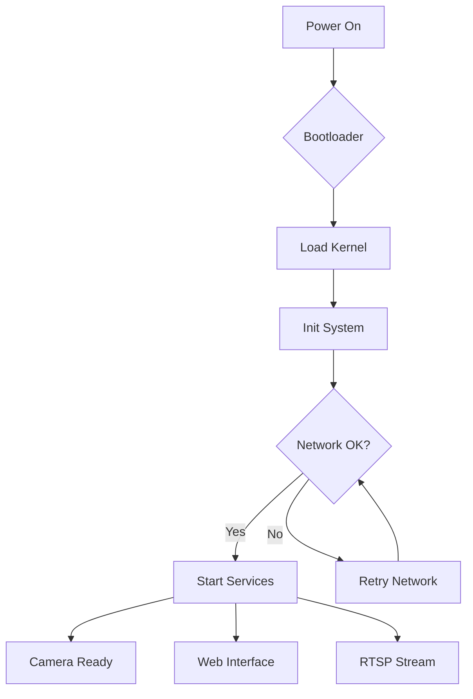
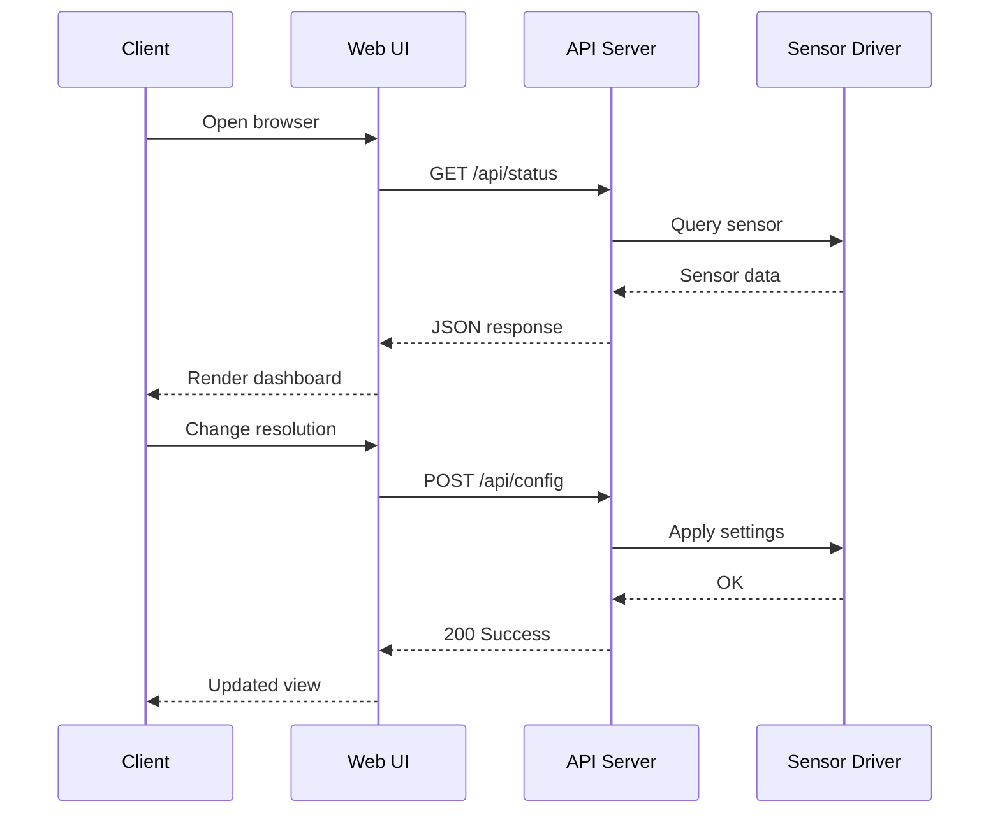
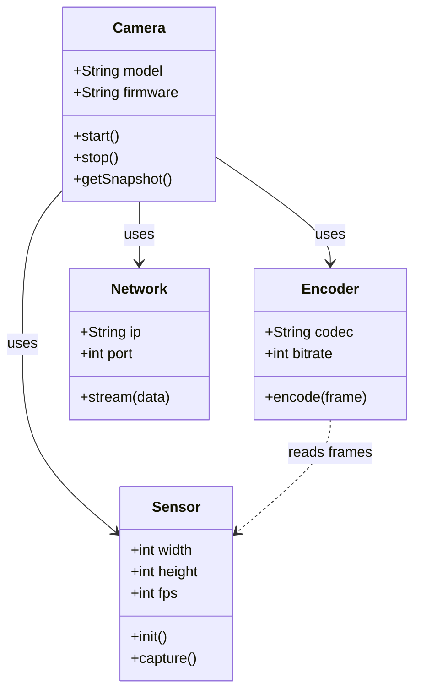
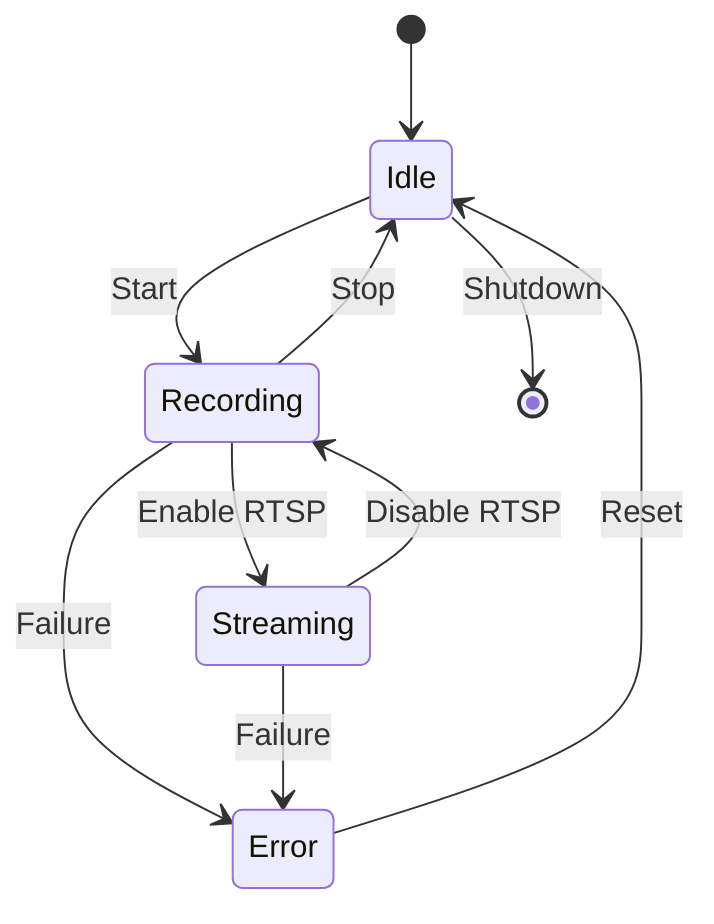
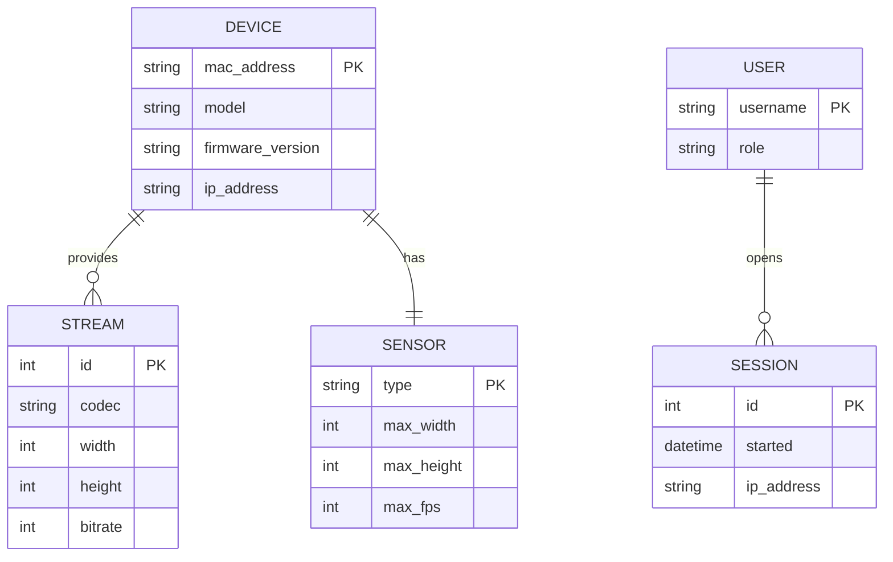

# UML Diagrams <!-- markdownlint-disable-line first-line-heading -->

Demonstration of UML and diagram support using [Mermaid](https://mermaid.js.org/).

## Flowchart

## Sequence Diagram

## Class Diagram

## State Diagram

## Gantt Chart

```mermaid
gantt
    title Firmware Update Process
    dateFormat  HH:mm
    axisFormat  %H:%M

    section Download
    Fetch firmware     :a1, 00:00, 3m
    Verify checksum    :a2, after a1, 1m

    section Install
    Backup config      :b1, after a2, 1m
    Flash firmware     :b2, after b1, 5m
    Verify flash       :b3, after b2, 1m

    section Restart
    Reboot device      :c1, after b3, 2m
    Restore config     :c2, after c1, 1m
    Health check       :c3, after c2, 1m
```

## Entity Relationship Diagram

